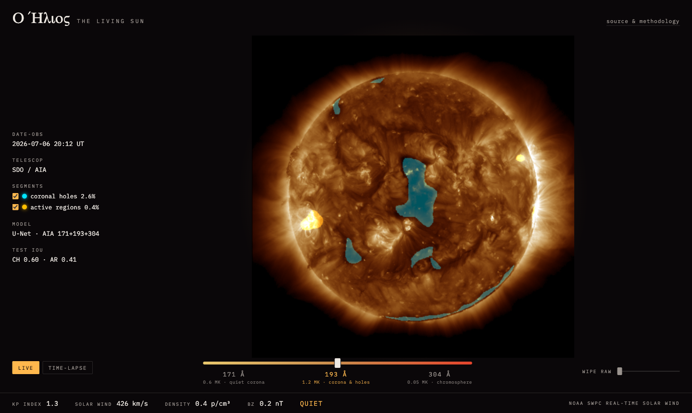

# Ο Ήλιος — The Living Sun

**The sun as it is right now, segmented by a U-Net.**
Live at **[captainjimbo.github.io/o-ilios](https://captainjimbo.github.io/o-ilios/)** — refreshed every 20 minutes, no servers.

[](https://captainjimbo.github.io/o-ilios/)

## What this is

A machine-learning observatory for the star next door:

- **Solar feature segmentation** — a U-Net (PyTorch, ImageNet-pretrained ResNet18
  encoder) takes full-disk SDO/AIA imagery in three EUV wavelengths (171/193/304 Å)
  and produces pixel masks for **coronal holes** (sources of fast solar wind) and
  **active regions** (the birthplaces of flares).
- **The Living Sun** — a WebGL front-end showing the latest sun with the masks as
  luminous overlays: a wavelength-morph slider, per-class toggles, a raw↔annotated
  wipe, and a time-lapse of AR 13664 (the May 2024 Gannon-superstorm region)
  crossing the disk, segmented frame by frame.
- **Conditions now** — live space weather (planetary Kp, solar wind speed/density,
  Bz) fetched in the browser from NOAA SWPC's real-time feeds.

## Results

Temporal holdout (train 2023–2024, test Aug–Oct 2025 — never random: adjacent
solar frames are near-duplicates and random splits leak), micro-averaged IoU
inside the solar disk:

| Model | Coronal hole IoU | Active region IoU |
|---|---|---|
| 193 Å intensity threshold (physics baseline, tuned on val) | 0.531 | 0.238 |
| **U-Net, 3-wavelength input** | **0.603** | **0.413** |

Labels are SPoCA detections from HEK — algorithmic, not human, ground truth; the
numbers read as agreement-with-the-operational-detector, and part of the gap is
label noise rather than model error. Full protocol, per-zone breakdowns, and the
failure modes stated plainly: **[EVALUATION.md](EVALUATION.md)**.

## How it works

```
pipeline/   AIA fetch (JSOC synoptic archive) · SPoCA/HEK label rasterization
            · dataset assembly · time-lapse generation
model/      threshold baseline · U-Net training (MPS) · evaluation · ONNX export
flare/      v2: SWAN-SF tabular pipeline · baselines · LightGBM + calibration
            · NRT SHARP inference · forecast ledger
worker/     scheduled job: latest sun in -> static artifacts out (no servers)
web/        React + Vite + WebGL2 (shader-blended wavelength morph)
```

There is no inference API. The sun updates every ~15 minutes, so a GitHub
Actions cron fetches the newest synoptic FITS, runs the ONNX model on CPU
(~2 s), renders the imagery and masks as static files, and redeploys the fully
static site to GitHub Pages. Model weights ship via a GitHub release, not git
history. Architecture decisions and rationale: **[ARCHITECTURE.md](ARCHITECTURE.md)**.

## Related work

NASA's [SDO "Sun Now"](https://sdo.gsfc.nasa.gov/data/) serves the raw imagery;
[Helioviewer](https://helioviewer.org/) is the general-purpose solar browser
(including SPoCA's own detections); [SolarMonitor](https://solarmonitor.org/)
annotates NOAA active regions daily. This project's contribution is the ML
layer: a model trained and honestly evaluated against those operational
detections, running live, with its test scores printed on the page it serves.

## Run it locally

```bash
python3 -m venv .venv && .venv/bin/pip install -r requirements.txt
.venv/bin/python -m pipeline.step1_sanity --date 2024-05-10   # data + labels sanity
.venv/bin/python -m pipeline.dataset --split all              # build the dataset
.venv/bin/python -m model.baseline                            # threshold baseline
.venv/bin/python -m model.train --epochs 40                   # train (Apple MPS)
.venv/bin/python -m model.evaluate                            # test IoU + gallery
.venv/bin/python -m model.export                              # -> ONNX
.venv/bin/python -m worker.run                                # live artifacts
cd web && npm install && npm run dev                          # the Living Sun
```

Data (SDO/AIA via JSOC, HEK/SPoCA, NOAA SWPC) is public and fetched on demand;
nothing large lives in git.

## v2 — Flare Watch (live)

The disk now carries **flare-probability badges**: a LightGBM model over
near-real-time SHARP magnetic-complexity keywords emits calibrated
P(M+ flare within 24 h) per active region, alongside **NOAA's own forecaster
numbers for the same regions** — and a public, append-only
[forecast ledger](https://captainjimbo.github.io/o-ilios/live/ledger.json)
records every day's prediction against what the sun actually did.

Trained on the SWAN-SF benchmark with a strict cross-partition protocol
(random splits leak to TSS ≈ 0.9 by memorization; we verified zero
active-region overlap between train and test). Final untouched-partition
score: **TSS 0.861, Brier skill +0.267 vs climatology** — and the write-up
explains why the second number is the one that matters:
**[EVALUATION-V2.md](EVALUATION-V2.md)**.

## Credits & license

Solar imagery: NASA SDO/AIA via [JSOC](http://jsoc.stanford.edu/) (Stanford).
Labels: [SPoCA](https://doi.org/10.1051/0004-6361/201321243) via the
[Heliophysics Events Knowledgebase](https://www.lmsal.com/hek/).
Space weather: [NOAA SWPC](https://www.swpc.noaa.gov/).
Built with [SunPy](https://sunpy.org/), PyTorch, ONNX Runtime, React.

MIT © 2026 Dimitris Kogias

---

*Built by [Dimitris Kogias](https://captainjimbo.github.io) — physicist & AI/ML systems engineer.*
